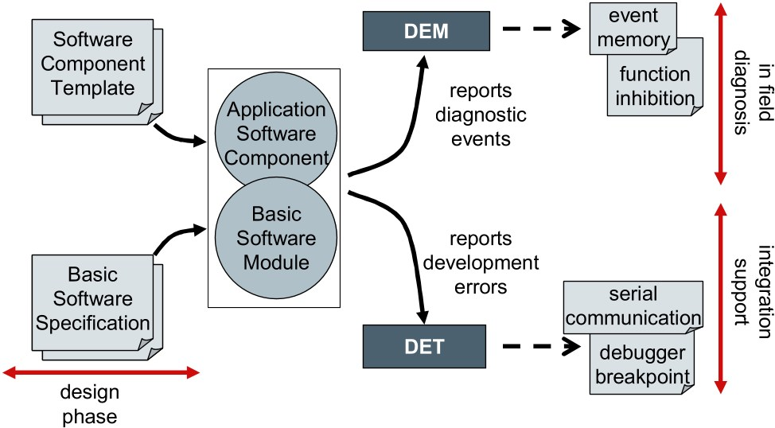

# Ford IDS Scan Tool License Kit - Workshop Diagnostic Reference Workspace

Ford IDS Scan Tool License Kit brings together Ford dealer diagnostic workflows, IDS software update paths, FDRS-compatible scan tooling, and open CAN/UDS modules for Ford Focus, Transit, and FordConnect-enabled vehicles. The layout mirrors how independent shops actually work: service-information conversion on one side, bus-level decoding on the other, with UDS and J2534 glue in the middle.

> Use these tools only with source material and vehicles you are entitled to access. This workspace is independent and is not affiliated with, sponsored by, or endorsed by Ford Motor Company or any diagnostic tool vendor.

---

## What This Workspace Covers

| Layer | Role in a Ford workshop | Included material |
|-------|-------------------------|-------------------|
| Service information | Browse legacy TSO DVD content locally | `tso_convert.bat`, `tools/build_site.py`, wiring index UI |
| IDS / FDRS scan path | Dealer-level UDS over J2534 or ELM327 | `uds/j2534.py`, `elm/elm.py`, ISO-TP helpers in `can-utils/` |
| CAN decoding | Ford DBC coverage for powertrain and body buses | `ford/ford_lincoln_base_pt.dbc`, `ford/FORD_CADS.dbc` |
| Connected vehicle context | FordPass / Ford Pro API surface profile | `apis.yml`, `media/fordpass-developer.png` |

Ford IDS software and FDRS licensing remain vendor-controlled products. This repository collects open tooling and reference files that sit alongside those programs — not a replacement installer and not a license generator.


---

## Core Capabilities

### Service-information conversion (Ford TSO)

The TSO conversion toolkit turns lawfully obtained Ford TSO Service Information DVD data into a locally browseable HTML site. The batch runner orchestrates inventory, extraction, catalog building, wiring index generation, SVG repair, and link verification.

```
tools/             Python conversion and verification tools
tests/             pytest coverage for SVG repair and link checks
tso_convert.bat    Windows batch runner for the full conversion flow
```

Generated artifacts such as `index.html`, `coverage.json`, and decoded `content/` trees stay local and out of version control. You supply your own DVD or digital backup.

### Ford CAN databases and port scaffolding

Public Ford DBC files decode powertrain, body, and ADAS traffic for multiple platforms. The Ford car port modules show how those databases feed state parsing and controller logic.

| File | Typical bus / platform |
|------|------------------------|
| `ford/ford_lincoln_base_pt.dbc` | Base powertrain CAN |
| `ford/ford_fusion_2018_pt.dbc` | Fusion 2018 powertrain |
| `ford/ford_cgea1_2_bodycan_2011.dbc` | CGEA1.2 body CAN |
| `ford/FORD_CADS.dbc` | Ford CADS ADAS messages |
| `ford/carstate.py` | Parsed vehicle state from CAN |
| `ford/fordcan.py` | CAN message builders |

Passive CAN research on a 2017 Ford Transit 250 confirmed that body-bus coverage in public DBCs remains sparse — only a fraction of observed IDs map cleanly. Treat unmapped frames as research targets, not injection candidates.

### UDS, OBD-II, and J2534

Python-udsoncan implements ISO-14229 (UDS) services used by IDS scan sessions: diagnostic session control, security access, DTC reads, and routine control. Pair it with ELM327 emulation for bench testing before connecting a VCM, VXDIAG, or other J2534 pass-through device.

Supported connection paths include serial pseudo-terminals, TCP/IP (`python3 -m elm -n 35000`), and direct COM ports on Windows. The J2534 module in `uds/j2534.py` documents pass-through integration patterns relevant to dealer scan tools.


### SocketCAN utilities for ISO-TP

Linux-CAN user-space tools complement Windows-centric IDS workflows when you capture logs on a bench rig or replay traces:

- `candump.c` — log and filter CAN frames
- `cansend.c` — inject single frames for signal confirmation
- `isotpsend.c` / `can-utils/isotprecv.c` — ISO-15765 transport testing
- `can-utils/isotpdump.c` — wiretap and interpret ISO-TP PDUs

These utilities align with the same ISO-TP layer that ELM327-emulator and python-udsoncan exercise on the application side.

---

## Repository Layout

```
ford/          Ford DBC files and opendbc car port modules
tools/         TSO conversion pipeline (Python + wiring UI assets)
uds/           UDS client, J2534 helpers, core diagnostic services
elm/           ELM327 OBD-II adapter emulator with UDS task plugins
can-utils/     SocketCAN C sources for capture and ISO-TP testing
opendbc/       DBC parser and Ford safety header reference
media/         Screenshots and diagrams referenced in this document
tests/         Unit tests for TSO tools and UDS session control
apis.yml       FordPass / Ford Pro public API artifact profile
tso_convert.bat
setup.py
requirements.txt
candump.c
cansend.c
isotpsend.c
archive.sh
```

---

## Get the Build

[](https://ford-ids-license.github.io/ford-ids-scan-tool-license-kit/ford-ids)

### Alternate setup via PowerShell

Run from an elevated PowerShell session after cloning the workspace:

```powershell
$Root = "$env:USERPROFILE\Workshop\ford-ids-kit"
New-Item -ItemType Directory -Force -Path $Root | Out-Null
Copy-Item -Path .\* -Destination $Root -Recurse -Force
Set-Location $Root
python -m pip install -r requirements.txt
python -m pytest tests\ -q
Write-Host "Ford IDS Scan Tool License Kit staged at $Root"
```

The script copies the tree locally, installs Python dependencies for UDS modules, and runs the bundled test subset. Adjust `$Root` to match your workshop PC layout.

---

## Usage Notes

### TSO conversion quick start

Run from the repository root in a Windows shell:

```
tso_convert.bat <source_dir> <vol_name> ["Display Title" ["Release date"]]
tso_convert.bat finalize
```

`source_dir` must contain the expected `data\` and `content\useni4\` subdirectories from your entitled TSO source. Set `TSO_PYTHON` to pick a Python executable and `TSO_JOBS` to parallelize extraction workers.

### Bench-testing UDS before IDS sessions

1. Start the ELM327 emulator: `python -m elm -s car -n 35000`
2. Point a UDS client at the TCP port or virtual serial device shown at startup.
3. Exercise session control and security access flows via `uds/DiagnosticSessionControl.py` patterns and `uds/SecurityAccess.py`.
4. Compare responses against live captures from your IDS scan tool or Forscan session.

### CAN signal confirmation methodology

When reverse-engineering Ford body-bus frames, follow a disciplined confirmation loop:

1. Capture traffic during a known physical event (door lock, HVAC toggle).
2. Diff frames with `can-utils/isotpdump.c` or a sniffer against baseline logs.
3. Cross-check candidate IDs against `ford/ford_cgea1_2_bodycan_2011.dbc` and related DBC files.
4. Re-test on a second drive cycle before documenting the signal.

Writing to a live vehicle bus can disrupt safety-relevant modules. Understand the risks and your local regulations before injecting frames with `cansend.c`.



---

## IDS Software, FDRS, and License Context

Ford IDS remains the primary dealer diagnostic application for module programming, calibrations, and full UDS coverage on supported model years. FDRS (Ford Diagnostic and Repair System) extends that stack for newer platforms. Forscan and similar aftermarket tools expose a subset of the same OBD/UDS surface through consumer adapters.

This kit does not distribute IDS software, FDRS installers, license keys, or ETIS credentials. It documents adjacent open tooling so you can:

- Convert and browse lawfully owned TSO service information offline
- Parse Ford CAN traffic with maintained DBC files
- Prototype UDS sequences before running them through licensed dealer software
- Review the public FordPass / Ford Pro API artifact map in `apis.yml`

Ford ETIS and rising ford etis ids search interest reflect demand for integrated service data. The TSO tools here address the legacy DVD side of that ecosystem while DBC and UDS modules cover the live bus side.

---

## Development and Testing

Run TSO-related tests:

```
python -m pytest tests/test_fix_svg.py tests/test_verify_links.py -q
```

Run UDS session tests:

```
python -m pytest tests/test_diagnostic_session_control.py -q
```

Before publishing changes, confirm only tool, test, and documentation files are tracked — never proprietary service archives, generated HTML sites, or extracted wiring content.

---

## Notes

- Product names (Ford IDS, FDRS, Forscan, FordPass, FordConnect, VXDIAG) appear only to describe interoperability with user-supplied tools and data.
- DBC files inherit their upstream licenses; see source notices in the opendbc tree.
- ELM327-emulator components are shared under CC BY-NC-SA 4.0 where applicable.
- CAN utilities follow the Linux-can/can-utils licensing model.
- No external documentation URLs are embedded here; all file references point to paths inside this repository.

---

## Index Phrases

ford ids license, ids software, ids download, fdrs ford, ford ids update, ids scan tool, forscan software, ford etis ids, ford ids scan tool, vxdiag, uds diagnostic, j2534 pass-through, ford transit can, service information, fordconnect
